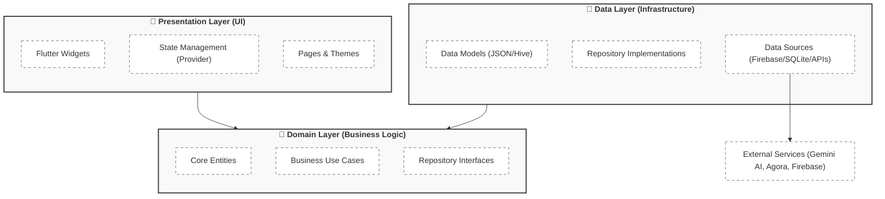

# 📱 WhatsApp AI - Intelligent Messaging & AI Ecosystem

[](https://flutter.dev)
[](https://firebase.google.com)
[](LICENSE)

WhatsApp AI is a complete, production-ready messaging ecosystem that integrates traditional communication with **Google's Gemini AI**, professional business tools, and a secure infrastructure.

---

## 📑 Table of Contents

- [📖 Overview](#-overview)
- [🏗️ Architecture](#-architecture)
- [✨ Key Features](#-key-features)
- [🛠️ Technology Stack](#-technology-stack)
- [🚀 Quick Start](#-quick-start)
- [📱 Application Components](#-application-components)
- [📂 Project Structure](#-project-structure)
- [🔒 Security](#-security)
- [📖 API Documentation](#-api-documentation)
- [🧪 Testing](#-testing)
- [🎨 Design System](#-design-system)
- [📚 Documentation](#-documentation)
- [🤝 Contributing](#-contributing)
- [📄 License](#-license)

---

## 📖 Overview

WhatsApp AI is a comprehensive communication platform that combines the familiarity of instant messaging with next-generation AI capabilities. The platform enables users to:

- **💬 Chat with AI Intelligence** - Get instant help and answers from Google Gemini.
- **📷 Visual Intelligence** - Scan receipts and analyze images with ML Kit.
- **💼 Manage Business Tools** - Showcase catalogs and track chat analytics.
- **🛡️ Stay Secure** - Biometric locking, secret vaults, and AES-256 encryption.
- **📞 HD Communication** - Seamless voice and video calls powered by Agora.

---

## 🏗️ Architecture

The project is architected using **Layered Clean Architecture** principles, ensuring a strict separation of concerns and making the codebase highly testable and scalable.



---

## ✨ Key Features

### 🤖 Core AI Integration
- ✅ **AI Assistant** - Integrated Google Gemini for smart chat interactions.
- ✅ **Visual IQ** - Receipt scanning and text recognition via Google ML Kit.
- ✅ **Automated Replies** - AI-powered suggestions and quick response management.
- ✅ **Text-to-Speech** - Natural voice synthesis for incoming messages.

### 💬 Messaging & Communication
- ✅ **Rich Chat** - Support for text, images, videos, audio, and documents.
- ✅ **HD Calls** - Real-time voice and video calls via Agora & WebRTC.
- ✅ **Broadcasts & Communities** - Modern tools for large-scale communication.
- ✅ **Interactive Status** - Share updates with rich media and interactive viewers.
- ✅ **Location Services** - Real-time location sharing and interactive maps.

### 💼 Professional Business Tools
- ✅ **Business Profile** - Professional presence management with custom branding.
- ✅ **Catalog Management** - Organize and showcase products within the app.
- ✅ **Chat Analytics** - Visualize messaging trends and user engagement.
- ✅ **QR Payments** - Dedicated send/receive payment workflows with QR scanning.

### 🔐 Safety & Security
- ✅ **Biometric Auth** - Fingerprint and Face ID support for app locking.
- ✅ **Secret Vault** - Hidden space for sensitive conversations.
- ✅ **View-Once Media** - Privacy-first media sharing that disappears after view.
- ✅ **End-to-End Security** - Secure authentication via Phone OTP and JWT.

---

## 🛠️ Technology Stack

### 📱 Flutter Mobile App
| Category | Technology | Version | Purpose |
| :--- | :--- | :--- | :--- |
| Framework | Flutter | ^3.11.0 | Core UI Framework |
| State | Provider | ^6.1.5 | State Management |
| AI | Gemini API | ^0.4.7 | Generative AI features |
| Reality | ML Kit | ^0.14.0 | Text recognition / Input |
| Real-time | Agora / WebRTC | ^0.12.1 | HD Voice & Video calls |
| DB | Hive / SQLite | ^2.2.3 | Local persistence |
| Maps | Google Maps | ^2.10.0 | Location & Tracking |
| Auth | Firebase Auth | ^5.4.1 | Secure Authentication |

### ☁️ Backend & Infrastructure
| Category | Technology | Purpose |
| :--- | :--- | :--- |
| Cloud | Firebase | Database, Storage, and Hosting |
| Functions | Node.js | Server-side logic & Push Notifications |
| DB | Firestore | NoSQL Real-time database |
| Storage | Cloud Storage | Media and document hosting |
| Messaging | FCM | Push notifications for all devices |

---

## 🚀 Quick Start

### Prerequisites
- [Flutter SDK](https://docs.flutter.dev/get-started/install) (^3.11.0)
- [Node.js](https://nodejs.org/) (v16+ for Cloud Functions)
- Firebase Account
- Gemini API Key ([Get one here](https://ai.google.dev/))

### Installation Steps

1️⃣ **Clone the Repository**
```bash
git clone https://github.com/your-username/whatsapp_ai.git
cd whatsapp_ai
```

2️⃣ **Setup Flutter App**
```bash
flutter pub get
# Add your API keys to local configuration
# Update google-services.json (Android) and GoogleService-Info.plist (iOS)
```

3️⃣ **Deploy Firebase Functions**
```bash
cd functions
npm install
firebase deploy --only functions
```

4️⃣ **Run the App**
```bash
flutter run
```

---

## 📂 Project Structure

```bash
whatsapp_ai/
├── lib/                        # Flutter source code
│   ├── presentation/           # UI Layer (Pages, Widgets, Providers)
│   ├── domain/                 # Business Logic (Entities, UseCases)
│   ├── data/                   # Data Layer (Models, Repositories)
│   ├── core/                   # Utilities, Themes, Constants
│   └── main.dart               # App entry point
├── functions/                  # Cloud Functions (Notifications/Logic)
├── assets/                     # Media & Animations
├── android/                    # Android Native Files
├── ios/                        # iOS Native Files
└── web/                        # Web Native Files
```

---

## 🔒 Security

WhatsApp AI implements multiple layers of security to protect user data:

- **AES-256 Encryption**: Used for sensitive data storage.
- **Local Auth**: Biometric locking using `local_auth`.
- **JWT Tokens**: Secure identity management for API requests.
- **Firebase Security Rules**: Granular control over database access.
- **Secret Vault**: Isolated storage for private conversations.

---

## 🧪 Testing

The project includes unit and widget tests for core functionality.

```bash
# Run all Flutter tests
flutter test

# Run with coverage report
flutter test --coverage
```

---

## 🎨 Design System

The app features a modern, clean UI inspired by best practices in mobile design:
- **Primary Color**: `#075E54` (WhatsApp Teal)
- **Secondary Color**: `#128C7E` (Light Teal)
- **Accent Color**: `#25D366` (Vibrant Green)
- **Typography**: Google Fonts (Inter / Roboto)

---

## 🌟 Features Roadmap

- [ ] Multi-language support (i18n)
- [ ] Advanced AI Image Generation (Stable Diffusion/DALL-E)
- [ ] Desktop native application (Windows/macOS)
- [ ] Blockchain-based identity verification

---

## 📄 License

This project is licensed under the MIT License - see the [LICENSE](LICENSE) file for details.

---

*Built with ❤️ for the future of messaging.*
# whatsapp_ai

# whatsapp_ai

